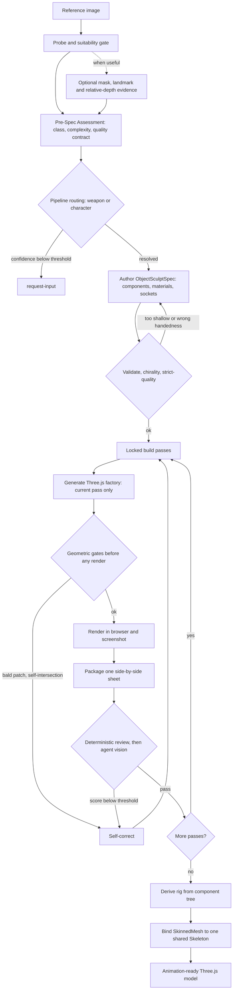

# Architecture

The full mechanism behind img2threejs: how the staged pipeline runs, why it stays token-efficient, what each script does, and what artifacts you get out the other end. The [README](../README.md) covers the pitch and quick start; this doc covers how it actually works.

---

## Pipeline overview

The skill runs a staged sculpting pipeline. Scripts gate each stage; the agent's vision is the only thing that can approve a pass.



Two things in that diagram are easy to miss and both were added because a render-only loop missed
them. **Geometric gates run before the browser does** — a bald patch or a self-intersection is found
on points, so a pass is never spent rendering geometry that was already wrong. And **routing can
refuse**: below a confidence of `0.82` the track resolves to `request-input` rather than guessing
whether the subject is a weapon or a character.

### Material reference hand-off

Material identity is an executable sub-pipeline rather than prose in the spec:

```text
named component region
  -> verified crop + observation
  -> material-reference.json resolver
  -> reference-derived PBR maps and bounded prior
  -> ObjectSculptSpec materialReference/materialPipeline
  -> generated material userData and color-space-safe maps
  -> multi-angle zoom/microscope capture
  -> per-region comparator and bounded feedback
  -> materialGate + material-pass unlock
```

`forge/materials/reference.py` is the runtime registry contract. The registry never decides from
colour alone and an ambiguous or low-confidence region remains `probe`/`request-input`. The
material gate also checks that UV/map bindings survive geometry, visual hull, skinning, collision,
morph and LOD changes. Existing specs without `materialPipeline` remain backward-compatible.

### Build passes

The model is sculpted in a fixed order; a pass unlocks only after the previous one is reviewed and accepted:

`blockout → structural-pass → form-refinement → material-pass → surface-pass → lighting-pass → interaction-pass → optimization-pass`

Each pass has its own acceptance criteria. A pass is marked `continue` only with a real render, a comparison sheet, an agent-vision score at or above threshold, and every identity-defining feature at or above its own threshold.

For resumable work, `forge/state.py` stores an atomic JSON checklist around this pipeline. Profile
steps for `character` and `cs2` are inserted before local spec authoring; correction counts are
bounded per pass and globally. `forge/next.py --state` reports the next ordered action and rejects
a positional spec that differs from the state artifact. This state index does not grant a pass:
the ObjectSculptSpec, render evidence, review history, and deterministic gates still decide.

### The gates

- **Suitability** — is the image a viable 3D target at all.
- **Pre-spec and strict-quality** — blocks code generation until the spec is deep enough for the object's complexity (no single-root spec for a compound object).
- **Chirality** — every `-l`/`-r` pair must be a sagittal mirror, not a rotated copy. Rotation preserves handedness, so a pair built by negating two axes comes out as the same hand twice. Hard, at spec time.
- **Scalp exposure (hair subjects)** — hard, and it runs on geometry before anything is drawn, because a bald patch is interior and an outline metric cannot see it.
- **Screenshot feedback** — `continue` requires a render plus a comparison sheet plus a passing vision score, plus banded interior difference: silhouette IoU reads roughly 11% of figure cells and scored a deleted face identically to a finished one.
- **Action-ready** — the model exposes a runtime hierarchy (pivots, sockets, colliders, destruction groups) via `root.userData.sculptRuntime`.
- **Attachment correctness** — child parts (handles, limbs, tubes) declare how they join their parent, so nothing floats in mid-air.
- **Material and lighting realism** — independent PBR channels and real lights, never albedo aliased into roughness.
- **Rig payload** — for character builds, the joint/parent/matrix payload is validated before a `THREE.Skeleton` is bound. It proves structural integrity only; pose stress and likeness stay separate gates.

The ordering matters more than the list. Everything measurable on geometry runs *before* the browser,
so a pass is never spent rendering something already known to be wrong.

### Self-correction

After every pass the agent chooses exactly one action: `continue`, `refine-spec`, `refine-code`, `request-input`, or `stop`. `refine-spec` fixes a wrong or shallow spec and re-validates; `refine-code` fixes geometry, material, or lighting that does not match a sound spec.

---

## Why it is token-efficient

Most image-to-3D agent loops burn tokens by asking the model to do mechanical work — re-reading the whole model every pass, scoring pixels, validating JSON by hand, re-running steps it already did. img2threejs pushes all of that into deterministic scripts and spends model tokens only where judgment is actually required.

- **Scripts enforce, the model judges.** The Python scripts handle validation, gating, spec authoring, PBR extraction, comparison-sheet packaging, and pipeline state. They never score visuals. The model's tokens go to one thing: looking at a single side-by-side sheet and deciding pass or fail.
- **Zero dependencies, zero install churn.** Every script is pure Python 3.10+ standard library. No pip, no PIL, no numpy, no Playwright. PNG read/write is done with `struct` and `zlib`. Nothing to install means nothing to debug in-context.
- **Pass-gated generation.** The code generator emits only the currently unlocked build pass. The model does not regenerate or re-read the entire model on every iteration — each step is small and scoped.
- **Fail fast, before codegen.** A strict-quality gate blocks shallow specs before a single line of Three.js is generated, so you never spend tokens rendering a model that was underspecified from the start.
- **One image per review.** Each pass is judged from exactly one packaged comparison sheet (reference beside render), not a scattering of screenshots.
- **Text output, not binaries.** The result is diffable TypeScript plus a JSON spec — small, reviewable, and version-controllable, instead of multi-megabyte mesh files.

The net effect: you still get a faithful 3D model from an image, but the expensive model context is reserved for visual judgment and code, not bookkeeping. For the full per-stage and per-cycle token breakdown, see [TOKEN_COST.md](TOKEN_COST.md).

---

## Scripts

| Script | Role |
| --- | --- |
| `stage1_intake/probe_image.py` | Image metadata and obvious technical issues (not a visual check). |
| `stage1_intake/probe_glb.py` | GLB provenance, bounds, scene inventory and conservative semantic-readiness assessment. |
| `stage2_spec/new_pre_spec_assessment.py` | Classify the object, score complexity, emit a quality contract. |
| `stage2_spec/new_sculpt_spec.py` | Author the ObjectSculptSpec from the assessment. |
| `stage2_spec/validate_sculpt_spec.py` | Validate the spec; `--strict-quality` blocks shallow specs before codegen. |
| `stage1_intake/extract_pbr_evidence.py` | Reference-derived PBR evidence per crop (inference, not inverse rendering). |
| `stage1_intake/material_region_analysis.py` | Region crop admission, PBR extraction, and material-reference resolution. |
| `stage2_spec/apply_material_analysis.py` | Material analysis to ObjectSculptSpec hand-off. |
| `stage3_build/orchestrate_passes.py` | Locked pass state: status, check, sync. |
| `stage3_build/generate_threejs_factory.py` | Emit the Three.js `Group` factory for the current unlocked pass. |
| `stage4_review/make_comparison_sheet.py` | Package one reference-vs-render sheet for review. |
| `stage4_review/append_review.py` | Record a per-pass review: scores, decision, evidence. |
| `stage4_review/material_views.py` | Deterministic material camera/crop/microscope plan and capture readback validation. |
| `stage4_review/material_comparator.py` | Per-region crop metrics and mismatch tags. |
| `stage4_review/material_gate.py` | Blocking material acceptance and cross-pass compatibility gate. |
| `stage4_review/validate_render_profile.py` | Validate the shared GLB/procedural renderer, camera and six-pass profile. |
| `stage4_review/compare_region_passes.py` | Compare paired browser diagnostic passes and block unsupported per-region claims. |
| `stage4_review/cs2_review.py` | Evaluate the blocking CS2 knife review contract and versioned scene thresholds. |
| `_shared/feature_acceptance_policy.py` | Internal helper enforcing per-feature score thresholds. |
| `stage1_intake/build_detail_inventory.py` | Slice the reference into zones and scaffold a detail inventory. |
| `stage1_intake/extract_landmarks.py` | Overlay a landmark grid and scaffold an anatomy block for characters. |
| `stage1_intake/solve_camera_pose.py` | Emit a reference-camera block so the render can be camera-matched. |
| `stage1_intake/delight_albedo.py` | Approximate a neutral albedo from the photo before texture projection. |
| `stage1_intake/run_vision_adapter.py` | Invoke optional isolated SAM2, MediaPipe, and Depth Anything evidence adapters. |
| `stage3_build/bake_projected_texture.py` | Emit a projection/UV-bake descriptor for photo-texture projection. |

### Character rig — `stage5_rig/`

| Script | Role |
| --- | --- |
| `stage5_rig/rig_spec.py` | Derive and validate a `RigSpec` from the component tree, so bones cannot drift from the geometry they drive. |
| `stage5_rig/geodesic_skinning.py` | Vertex weights from distance measured *through the solid*; partitions rigid roles out of smooth skinning. |
| `stage5_rig/emit_rig.py` | The one vertex-weight implementation, ported into the generator rather than duplicated. |
| `stage5_rig/validate_rig_payload.py` | Blocking payload-integrity gate before binding a `THREE.Skeleton`. Proves structure only, never pose or likeness. |

### Hair

| Script | Role |
| --- | --- |
| `stage1_intake/extract_hair_evidence.py` | Otsu hair/skin split, banded coverage, the hairline, highlight band, root-to-tip delta. Unseen views report `notObserved`. |
| `stage2_spec/hair_profile.py` | The hairstyle schema and its validation. Roots are scalp `(u, v)`; an absolute root is a hard error. |
| `_shared/scalp_field.py` | Signed distance to a skull built from the head component's own ring stack. |
| `stage4_review/scalp_exposure.py` | **HARD** gate: finds bald patches on geometry, before any render. |
| `stage4_review/hair_gate.py` | Soft gate: banded coverage, hairline and highlight offsets. Subordinate to scalp exposure. |

### Chirality, review and structure

| Script | Role |
| --- | --- |
| `_shared/chirality.py` | Left/right as code. `check_pair` catches a rotated pair; `medial_lateral_bias` catches a pair wrong the same way on both sides. |
| `stage4_review/interior_difference.py` | Appearance difference *inside* the silhouette, banded by height. Required on every visual pass. |
| `stage4_review/divine_eye.py` | The deterministic multi-signal render evaluator; hard gates plus soft signals with self-uncertainty. |
| `stage4_review/vlm_gate.py` | Gated, calibrated last layer. Never consulted on a hard-gate failure. |
| `stage4_review/fit_params.py` | Bounded, gate-aware analysis-by-synthesis parameter fitting. |
| `stage4_review/self_intersection.py`, `turntable_gate.py`, `attachment_anchor.py`, `joint_loops.py`, `pairwise_penetration.py`, `geometry_integrity.py` | Off-axis, placement and topology gates that run on geometry rather than pixels. |
| `stage3_build/visual_hull.py`, `uv_unwrap.py`, `morph_targets.py`, `decimate.py` | Hull carving, UV unwrap, blendshape targets and quadric decimation. |
| `_shared/pipeline_routing.py` | Fail-closed weapon/character routing; below `0.82` confidence it resolves to `request-input`. |
| `_shared/workflow_state.py`, `state.py`, `next.py` | The resumable ordered checklist and the next-action reporter. |

This table is a curated selection, not an inventory — `forge/` holds around ninety modules. The
executable reference, with every flag and the measurement behind each threshold, is
`grimoire/scripts.md`; the gate-by-gate contract is `grimoire/review/gates_reference.md`. The rest of
`grimoire/` holds the rubrics each gate applies (validation, pre-spec assessment, procedural patterns,
material and lighting realism, attachment correctness, action-ready models, self-correction).

---

## What you get

- An `ObjectSculptSpec` JSON: the full component tree, materials, repetition systems, sockets, and a recorded review history for every pass.
- A TypeScript `createObjectNameModel(spec, options)` factory returning a `THREE.Group`, with `root.userData.sculptRuntime` exposing nodes, sockets, colliders, and destruction groups.
- For character builds, `root.userData.rig`: the bones, one shared `Skeleton`, bone order and index map, and a `bound` flag that is computed rather than asserted — it is true only when every skinned mesh actually bound.
- A render plus comparison sheets documenting the fidelity at each pass.
