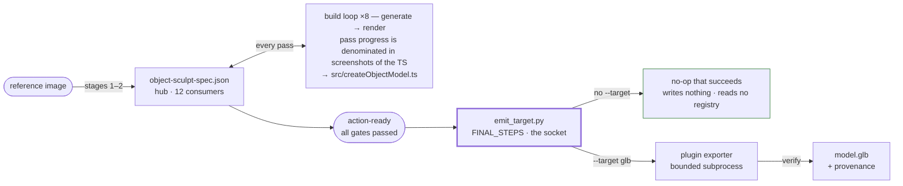
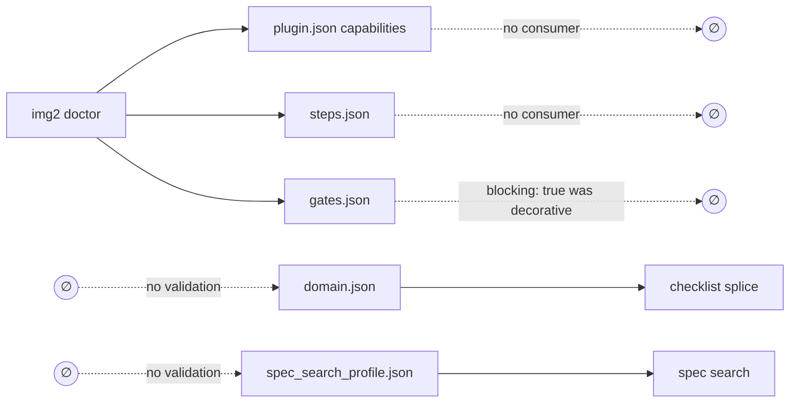
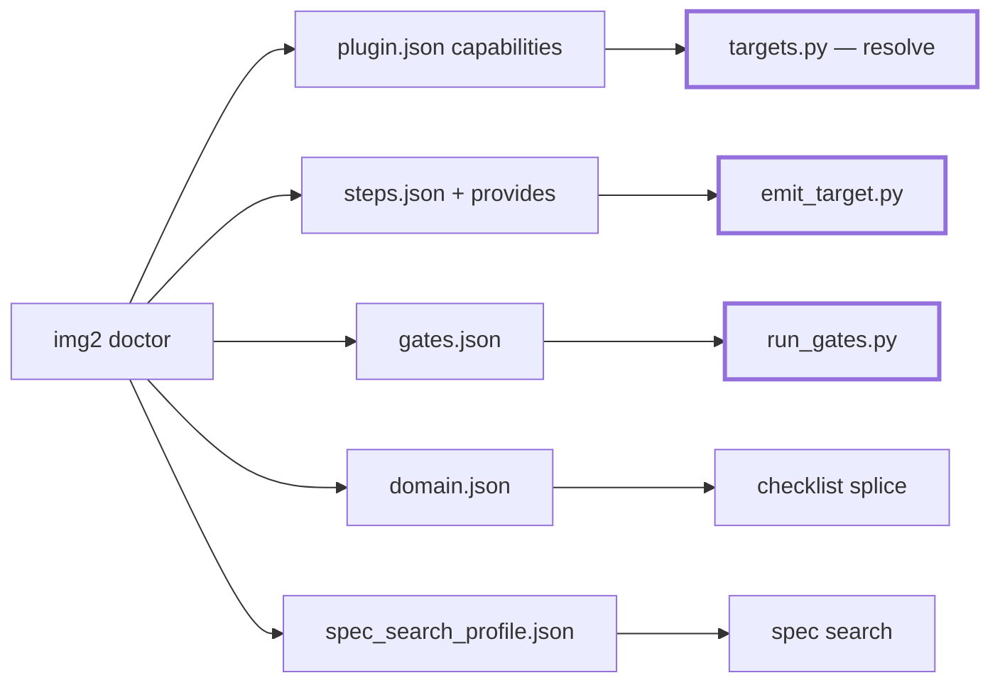
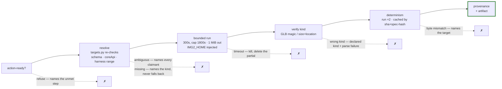
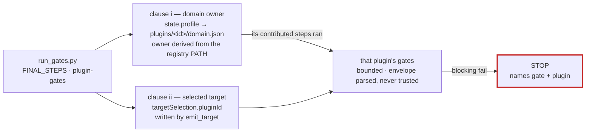

# The Emission Target Socket

The pipeline's terminal export point. The default output stays byte-identical procedural Three.js
TypeScript; an exporter (GLB, FBX, …) is an installed plugin selected explicitly with `--target` —
zero base changes, proven continuously by the sculpt-echo round-trip test's clean-`git diff`
assertion. Contract text: `img2` PLUGIN_CONTRACT draft sections and plugin-wiki Scenario 12.

## 1. The flow — a target is an addition, never a replacement

The spec is the architecture's real fork point: `object-sculpt-spec.json` has 12 non-test consumers
in `forge/`, and the TypeScript emitter is one of them. The per-pass build loop is untouched; the
socket runs only after every gate has passed.

With no `--target` the export step is a no-op that returns **before any registry read** — a
malformed `plugins.json` cannot break the default path. Selecting a target adds a second artifact
beside the TypeScript; nothing is replaced, overridden or removed.

## 2. The plugin surface — from two disjoint halves to one

The PR #106 review's central finding: everything `doctor` validated was consumed by nothing, and
everything that drove the run was validated by nothing.

**Before** — dashed edges are the missing half of each file's life:

**After** — every declaration file is validated *and* has a named consumer; the two bold consumers
are the ones this change built:

Placeholder vocabularies are closed **per consumer**, matching what each renderer actually
substitutes — one uniform set was never true:

| file | vocabulary | renderer |
|---|---|---|
| `steps.json` / `gates.json` | `{plugin_dir}` `{workspace}` `{image}` `{spec}` | harness-executed argv |
| `domain.json` | `{plugin_dir}` `{reference}` `{spec}` `{pass_id}` | checklist `.format()` — `{workspace}`/`{image}` there would `KeyError` |

Shell-metacharacter hardening applies to command rows (leading token is a path or known
interpreter); prose instruction rows — which the cookbook's own examples contain, parentheses and
all — get vocabulary checks only.

## 3. Inside the socket — every failure path has a name

There is no silent fallback: *selected-and-failed* is never *nothing-selected*. Only the latter
falls back to the default TypeScript path. The base warrants the TypeScript model and its gates; a
target artifact carries provenance plus the target plugin's own gate verdicts, and no base quality
warranty beyond container/existence/size/location/determinism.

## 4. Gate execution — the two-clause participation rule

Every shipped plugin's `blocking: true` gate had never executed anywhere. `run_gates.py` runs them
behind a rule derivable from workspace state — never from name matching:

A plugin that contributed no step to the workspace's checklist runs no gates. A malformed verdict
envelope is an error, never a pass, and a verdict's declared status must agree with its exit code.

## Why the third design

| | design | why it fell / held |
|---|---|---|
| ✗ | **A — fragment splicing** at 8 anchors inside `generate()` | AST showed 7 of 8 anchors are not seams (a 711-line decomposition of a 1,753-line function); fragments are compiled-and-executed TS; substitution dragged in the reserved `overrides` mechanism |
| ✗ | **B — manifest-level target edge** | right axis, two false economic claims: resolution existed but *invocation* did not (no `{spec}` placeholder), and the base emitter does not natively conform (overloaded exit 2, envelope-less error paths) |
| ✓ | **C — `provides` on a step row + terminal socket** | uses the contract's own documented upgrade path: manifest edge = *discovery*, step row = *invocation + artifact*, targetness lives in the **user's query**; nothing is replaced, so no override machinery is needed |

Full review trail (5 adversarial reviews, 43+ recorded decisions):
`openspec/changes/establish-the-emission-target-contract/review/` in the org workspace.
